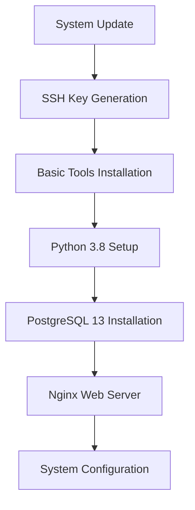

# 🛠️ AlmaLinux 9 Dependency Installation Guide

## 📋 Overview
This comprehensive guide covers the installation of essential dependencies for setting up a complete development and production environment on AlmaLinux 9. The guide includes SSH key generation, system updates, development tools, databases, and web servers.

## 🎯 Prerequisites
- AlmaLinux 9.x server or workstation
- Root or sudo access
- Internet connectivity
- Basic command line knowledge

## 📦 Installation Roadmap



---

## 🔐 1. Generate SSH Key

**Purpose**: Create secure SSH keys for authentication and Git operations.

```bash
ssh-keygen -t rsa -b 4096
```

**📝 Notes:**
- Creates a 4096-bit RSA key pair
- Follow prompts to set passphrase (recommended)
- Keys stored in `~/.ssh/` directory

---

## 🔄 2. System Update

**Purpose**: Ensure all system packages are up-to-date before installation.

```bash
sudo yum update -y
```

**⚠️ Important**: Reboot if kernel updates are installed.

---

## 📝 3. Install Basic Development Tools

### Install Nano Editor
**Purpose**: Lightweight text editor for configuration files.

```bash
sudo yum install -y nano
```

### Install Git Version Control
**Purpose**: Essential for code management and deployment.

```bash
sudo yum install git
```

**🔧 Post-installation**: Configure Git with your credentials:
```bash
git config --global user.name "Your Name"
git config --global user.email "your.email@example.com"
```

---

## 🐍 4. Install Python 3.8

**Purpose**: Modern Python environment for application development.

### Step 1: Update System and Install Development Tools
```bash
sudo yum -y update
```

```bash
sudo yum -y groupinstall "Development Tools"
```

### Step 2: Install Required Dependencies
```bash
sudo yum -y install openssl-devel bzip2-devel libffi-devel
```

### Step 3: Download Python Source
```bash
sudo yum -y install wget
```

```bash
wget https://www.python.org/ftp/python/3.8.3/Python-3.8.3.tgz
```

### Step 4: Extract and Compile
```bash
tar xvf Python-3.8.3.tgz
```

```bash
cd Python-3.8*/
```

```bash
./configure --enable-optimizations
```

```bash
sudo make altinstall
```

**✅ Verification**: Check installation:
```bash
python3.8 --version
pip3.8 --version
```

**🧹 Cleanup**: Remove source files:
```bash
cd .. && rm -rf Python-3.8* && rm Python-3.8.3.tgz
```

---

## 🗄️ 5. Install PostgreSQL 13

**Purpose**: Robust relational database for enterprise applications.

### 🔁 Step 1: Clean Previous Installations
**Remove all existing PGDG files and metadata**
```bash
sudo dnf remove -y pgdg-redhat-repo
sudo rm -f /etc/yum.repos.d/pgdg-*.repo
sudo rm -f /etc/pki/rpm-gpg/*PGDG*
sudo dnf clean all
sudo rm -rf /var/cache/dnf
```

### 🔑 Step 2: Import PostgreSQL GPG Key
**Manually import the correct GPG key for PostgreSQL 13**
```bash
sudo rpm --import https://download.postgresql.org/pub/repos/yum/RPM-GPG-KEY-PGDG-13
```

### 📦 Step 3: Install PGDG Repository
**Reinstall the PGDG repo for EL9 (AlmaLinux 9)**
```bash
sudo dnf install -y https://download.postgresql.org/pub/repos/yum/reporpms/EL-9-x86_64/pgdg-redhat-repo-latest.noarch.rpm
```

**List available PostgreSQL packages:**
```bash
sudo yum list postgresql*
```

### 🚫 Step 4: Disable Default PostgreSQL Module
```bash
sudo dnf module disable postgresql
```

### 🔄 Step 5: Refresh Package Cache
**Clean and rebuild metadata cache**
```bash
sudo dnf clean all
sudo dnf makecache --refresh
```

### 📥 Step 6: Install PostgreSQL 13
```bash
sudo dnf install -y postgresql13 postgresql13-server
```

### ⚙️ Step 7: Initialize and Start PostgreSQL
```bash
sudo /usr/pgsql-13/bin/postgresql-13-setup initdb
```

```bash
sudo systemctl start postgresql-13.service
```

```bash
sudo systemctl enable postgresql-13.service
```

### ✅ Step 8: Verify Installation
```bash
sudo systemctl status postgresql-13.service
```

**🔧 Post-installation Configuration:**
```bash
# Switch to postgres user
sudo -u postgres psql

# Set password for postgres user
\password postgres

# Exit PostgreSQL
\q
```

---

## 🌐 6. Install Nginx Web Server

**Purpose**: High-performance web server and reverse proxy.

### Step 1: Install EPEL Repository
```bash
sudo yum install epel-release
```

### Step 2: Install Nginx
```bash
sudo yum install nginx
```

### Step 3: Start and Enable Nginx
```bash
sudo systemctl start nginx
```

```bash
sudo systemctl enable nginx
```

### Step 4: Verify Installation
```bash
sudo systemctl status nginx
```

**🔥 Firewall Configuration:**
```bash
sudo firewall-cmd --permanent --add-service=http
sudo firewall-cmd --permanent --add-service=https
sudo firewall-cmd --reload
```

**🌍 Test Access**: Open browser and navigate to your server's IP address.

---

## 🔧 Post-Installation Configuration

### System Optimization
```bash
# Update system limits
echo "* soft nofile 65536" | sudo tee -a /etc/security/limits.conf
echo "* hard nofile 65536" | sudo tee -a /etc/security/limits.conf

# Configure SELinux (if needed)
sudo setsebool -P httpd_can_network_connect 1
```

### Create Virtual Environment
```bash
# Create Python virtual environment
python3.8 -m venv /opt/venv
source /opt/venv/bin/activate
pip install --upgrade pip
```

---

## ✅ Verification Checklist

- [ ] SSH keys generated and configured
- [ ] System fully updated
- [ ] Git installed and configured
- [ ] Python 3.8 installed and accessible
- [ ] PostgreSQL 13 running and accessible
- [ ] Nginx running and serving default page
- [ ] Firewall configured for web traffic
- [ ] Virtual environment created

---

## 🚨 Troubleshooting

### Common Issues

**Python Installation Fails:**
```bash
# Install additional dependencies
sudo yum install -y gcc gcc-c++ make zlib-devel
```

**PostgreSQL Connection Issues:**
```bash
# Check PostgreSQL logs
sudo tail -f /var/lib/pgsql/13/data/log/postgresql-*.log

# Restart PostgreSQL
sudo systemctl restart postgresql-13
```

**Nginx Permission Denied:**
```bash
# Check SELinux status
sudo getenforce

# Temporarily disable SELinux (for testing)
sudo setenforce 0
```

### Useful Commands
```bash
# Check all installed packages
rpm -qa | grep -E "python|postgresql|nginx"

# Monitor system resources
top
htop
df -h
free -h

# Check service logs
journalctl -u postgresql-13 -f
journalctl -u nginx -f
```

---

## 📚 Next Steps

1. **Database Setup**: Configure PostgreSQL users and databases
2. **Web Configuration**: Set up Nginx virtual hosts
3. **Application Deployment**: Deploy your Python applications
4. **SSL Certificates**: Install and configure SSL/TLS
5. **Monitoring**: Set up system and application monitoring
6. **Backup Strategy**: Implement automated backup solutions

---

## 🔗 Related Documentation

- [PostgreSQL Configuration](../database/postgresql.md)
- [Nginx Configuration](../config/nginx.conf)
- [SSL Certificate Installation](install-ssl-certificate.md)
- [Database Backup Setup](database_autobackup.md)

---

**📅 Last Updated**: $(date +'%Y-%m-%d')

**🏷️ Version**: 2.0.0

**👥 Maintainer**: System Administration Team

        